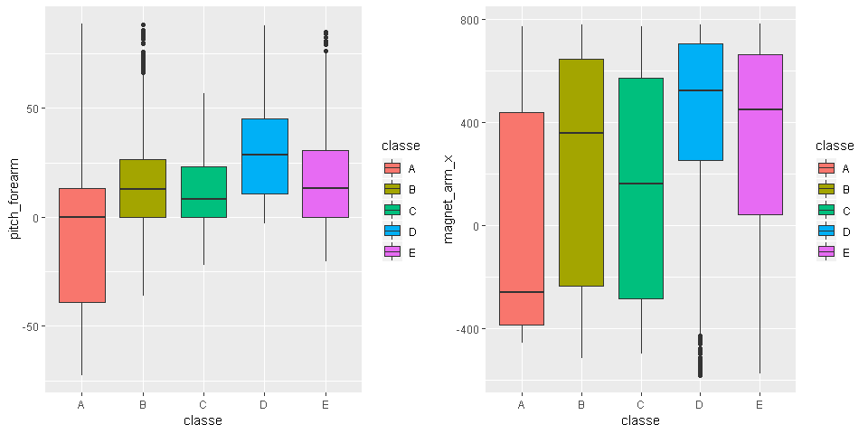
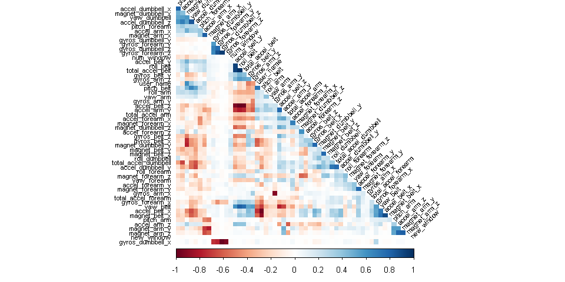
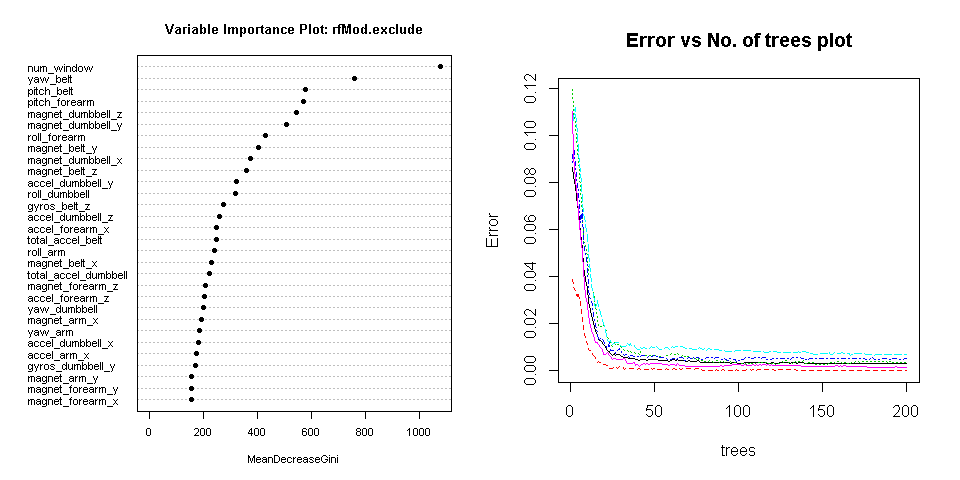
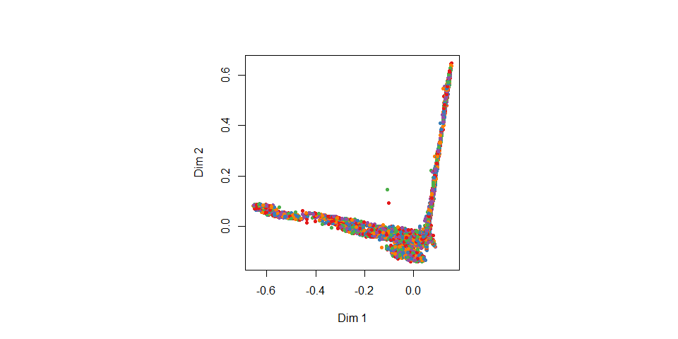
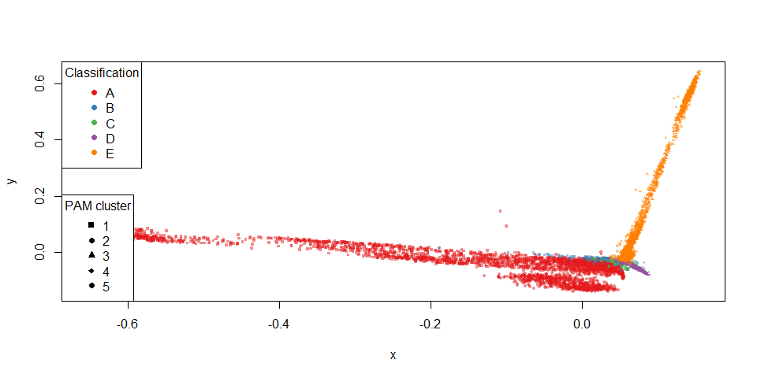

## Load Libraries

```r
library(lattice)
library(ggplot2)
library(plyr)
library(randomForest)
library(caret)
library(Rmisc)
```
## Executive Summary

Based on a dataset provide by HAR [http://web.archive.org/web/20161224072740/http:/groupware.les.inf.puc-rio.br/har](http://web.archive.org/web/20161224072740/http:/groupware.les.inf.puc-rio.br/har) we will try to train a predictive model to predict what exercise was performed using a dataset with 159 features.

Step 1: Process the training & testing data, from specifid source
Step 2: Explore the data, especially focussing on the two paramaters 
Step 3: Model selection, where we try different models to help us answer our questions
Step 4: Model examination, to see wether our best model holds up to our standards
Step 5: A Conclusion where we answer the questions based on the data
Step 6: Predicting the classification of the model on test set

### Step 1: Data Processing


```r
trainURL <- "https://d396qusza40orc.cloudfront.net/predmachlearn/pml-training.csv"
testURL <- "https://d396qusza40orc.cloudfront.net/predmachlearn/pml-testing.csv"
download.file(trainURL,destfile = "training.csv")
download.file(testURL,destfile = "testing.csv")

trainingdata <- read.csv("training.csv")
testingdata <- read.csv("testing.csv")

dim(trainingdata);dim(testingdata)
```

```
## [1] 19622   160
```

```
## [1]  20 160
```


```r
#Remove NA Columns with more than 20% data as NA
maxNAPer <- 20
maxNALimit <- nrow(trainingdata)/100*maxNAPer
removeNA <- which(colSums(is.na(trainingdata)|trainingdata=="")> maxNALimit)


trainingdata <- trainingdata[,-removeNA]
testingdata <- testingdata[,-removeNA]

# Remove all time series data as we dont need them
removeTime <- grep("timestamp",names(trainingdata))
trainingdata <- trainingdata[,-c(1,removeTime)]
testingdata <- testingdata[,-c(1,removeTime)]

# Convert all factors to integers
classelevels <- levels(trainingdata$classe)
cleantrainingdata <- data.frame(data.matrix(trainingdata))
cleantrainingdata$classe <- factor(cleantrainingdata$classe,labels = classelevels)
cleantestingdata <- data.frame(data.matrix(testingdata))

rm(trainingdata)
rm(testingdata)
```

### Exploratory data analyses 

Since the test set provided is the final validation set, we will split the current training in a test and train set to work with.


```r
set.seed(1182)
classeIndex <- which(names(cleantrainingdata) == "classe")
inTrain <- createDataPartition(y=cleantrainingdata$classe, p=0.75, list=FALSE)
subTrain <- cleantrainingdata[inTrain, ]
subTest <- cleantrainingdata[-inTrain, ]
```

Identify fields that have high correlations with the classe.

```r
correlations <- cor(subTrain[, - classeIndex], as.numeric(subTrain$classe))
bestCorrelations <- subset(as.data.frame(as.table(correlations)), abs(Freq)>0.3)
bestCorrelations
```

```
##             Var1 Var2      Freq
## 44 pitch_forearm    A 0.3396155
```

That frequency is just little above 0.3


```r
p1 <- ggplot(subTrain, aes(classe,pitch_forearm)) + 
  geom_boxplot(aes(fill=classe))
p2 <- ggplot(subTrain, aes(classe, magnet_arm_x)) + 
  geom_boxplot(aes(fill=classe))
multiplot(p1,p2,cols=2)
```

<!-- -->
These charts that indicate that there is no firm separation of classes. Next step will be to train model to improve prediction.

### Model selection 

Let's identify variables with high correlations amongst each other in our set, so we can possibly exclude them from the pca or training. 

We will check afterwards if these modifications to the dataset make the model more accurate (and perhaps even faster)


```r
library(corrplot)
correlationMatrix <- cor(subTrain[, -classeIndex])
highlyCorrelated <- findCorrelation(correlationMatrix, cutoff=0.9, exact=TRUE)
excludeColumns <- c(highlyCorrelated, classeIndex)
corrplot(correlationMatrix, method="color", type="lower", order="hclust", tl.cex=0.70, tl.col="black", tl.srt = 45, diag = FALSE)
```

<!-- -->

We see that there are some features that are quite correlated with each other.
We will have a model with these excluded. Also we'll try and reduce the features by running PCA on all and the excluded subset of the features


```r
pcaPreProcess.all <- preProcess(subTrain[, -classeIndex], method = "pca", thresh = 0.99)
subTrain.pca.all <- predict(pcaPreProcess.all, subTrain[, -classeIndex])
subTest.pca.all <- predict(pcaPreProcess.all, subTest[, -classeIndex])
testing.pca.all <- predict(pcaPreProcess.all, cleantestingdata[, -classeIndex])
pcaPreProcess.subset <- preProcess(subTrain[, -excludeColumns], method = "pca", thresh = 0.99)
subTrain.pca.subset <- predict(pcaPreProcess.subset, subTrain[, -excludeColumns])
subTest.pca.subset <- predict(pcaPreProcess.subset, subTest[, -excludeColumns])
testing.pca.subset <- predict(pcaPreProcess.subset, cleantestingdata[, -classeIndex])
```

Now we'll do some actual Random Forest training.
We'll use 200 trees, because I've already seen that the error rate doesn't decline a lot after say 50 trees, but we still want to be thorough.
Also we will time each of the 4 random forest models to see if when all else is equal one pops out as the faster one.


```r
library(randomForest)
ntree <- 200 #This is enough for great accuracy (trust me, I'm an engineer). 

start <- proc.time()
rfMod.cleaned <- randomForest(
  x=subTrain[, -classeIndex], 
  y=subTrain$classe,
  xtest=subTest[, -classeIndex], 
  ytest=subTest$classe, 
  ntree=ntree,
  keep.forest=TRUE,
  proximity=TRUE) #do.trace=TRUE
proc.time() - start
```

```
##    user  system elapsed 
##   92.15    2.08   94.68
```

```r
gc()
```

```
##             used   (Mb) gc trigger   (Mb)  max used   (Mb)
## Ncells   2592001  138.5    4881381  260.7   4881381  260.7
## Vcells 322236372 2458.5  932854795 7117.2 970003789 7400.6
```


```r
start <- proc.time()
rfMod.exclude <- randomForest(
  x=subTrain[, -excludeColumns], 
  y=subTrain$classe,
  xtest=subTest[, -excludeColumns], 
  ytest=subTest$classe, 
  ntree=ntree,
  keep.forest=TRUE,
  proximity=TRUE) #do.trace=TRUE
proc.time() - start
```

```
##    user  system elapsed 
##   88.88    2.48   92.01
```


```r
start <- proc.time()
rfMod.pca.all <- randomForest(
  x=subTrain.pca.all, 
  y=subTrain$classe,
  xtest=subTest.pca.all, 
  ytest=subTest$classe, 
  ntree=ntree,
  keep.forest=TRUE,
  proximity=TRUE) #do.trace=TRUE
proc.time() - start
```

```
##    user  system elapsed 
##   87.24    4.71   92.54
```


```r
start <- proc.time()
rfMod.pca.subset <- randomForest(
  x=subTrain.pca.subset, 
  y=subTrain$classe,
  xtest=subTest.pca.subset, 
  ytest=subTest$classe, 
  ntree=ntree,
  keep.forest=TRUE,
  proximity=TRUE) #do.trace=TRUE
proc.time() - start
```

```
##    user  system elapsed 
##  152.59   17.22  239.57
```

```r
gc()
```

```
##              used   (Mb) gc trigger    (Mb)   max used    (Mb)
## Ncells    2592445  138.5    4881381   260.7    4881381   260.7
## Vcells 1267193694 9668.0 2181983765 16647.3 1929218957 14718.8
```


## Model examination

Now that we have 4 trained models, we will check the accuracies of each.
(There probably is a better way, but this still works good)


```r
rfMod.cleaned
```

```
## 
## Call:
##  randomForest(x = subTrain[, -classeIndex], y = subTrain$classe,      xtest = subTest[, -classeIndex], ytest = subTest$classe,      ntree = ntree, proximity = TRUE, keep.forest = TRUE) 
##                Type of random forest: classification
##                      Number of trees: 200
## No. of variables tried at each split: 7
## 
##         OOB estimate of  error rate: 0.27%
## Confusion matrix:
##      A    B    C    D    E class.error
## A 4185    0    0    0    0 0.000000000
## B    6 2839    3    0    0 0.003160112
## C    0    9 2558    0    0 0.003506038
## D    0    0   15 2396    1 0.006633499
## E    0    0    0    6 2700 0.002217295
##                 Test set error rate: 0.22%
## Confusion matrix:
##      A   B   C   D   E class.error
## A 1395   0   0   0   0 0.000000000
## B    5 944   0   0   0 0.005268704
## C    0   2 853   0   0 0.002339181
## D    0   0   3 801   0 0.003731343
## E    0   0   0   1 900 0.001109878
```

```r
rfMod.cleaned.training.acc <- round(1-sum(rfMod.cleaned$confusion[, 'class.error']),3)
paste0("Accuracy on training: ",rfMod.cleaned.training.acc)
```

```
## [1] "Accuracy on training: 0.984"
```

```r
rfMod.cleaned.testing.acc <- round(1-sum(rfMod.cleaned$test$confusion[, 'class.error']),3)
paste0("Accuracy on testing: ",rfMod.cleaned.testing.acc)
```

```
## [1] "Accuracy on testing: 0.988"
```

```r
rfMod.exclude
```

```
## 
## Call:
##  randomForest(x = subTrain[, -excludeColumns], y = subTrain$classe,      xtest = subTest[, -excludeColumns], ytest = subTest$classe,      ntree = ntree, proximity = TRUE, keep.forest = TRUE) 
##                Type of random forest: classification
##                      Number of trees: 200
## No. of variables tried at each split: 6
## 
##         OOB estimate of  error rate: 0.31%
## Confusion matrix:
##      A    B    C    D    E  class.error
## A 4184    0    0    0    1 0.0002389486
## B    7 2838    3    0    0 0.0035112360
## C    0   11 2554    2    0 0.0050642774
## D    0    0   16 2395    1 0.0070480929
## E    0    0    0    4 2702 0.0014781966
##                 Test set error rate: 0.24%
## Confusion matrix:
##      A   B   C   D   E class.error
## A 1395   0   0   0   0 0.000000000
## B    5 944   0   0   0 0.005268704
## C    0   4 851   0   0 0.004678363
## D    0   0   2 802   0 0.002487562
## E    0   0   0   1 900 0.001109878
```

```r
rfMod.exclude.training.acc <- round(1-sum(rfMod.exclude$confusion[, 'class.error']),3)
paste0("Accuracy on training: ",rfMod.exclude.training.acc)
```

```
## [1] "Accuracy on training: 0.983"
```

```r
rfMod.exclude.testing.acc <- round(1-sum(rfMod.exclude$test$confusion[, 'class.error']),3)
paste0("Accuracy on testing: ",rfMod.exclude.testing.acc)
```

```
## [1] "Accuracy on testing: 0.986"
```

```r
rfMod.pca.all
```

```
## 
## Call:
##  randomForest(x = subTrain.pca.all, y = subTrain$classe, xtest = subTest.pca.all,      ytest = subTest$classe, ntree = ntree, proximity = TRUE,      keep.forest = TRUE) 
##                Type of random forest: classification
##                      Number of trees: 200
## No. of variables tried at each split: 6
## 
##         OOB estimate of  error rate: 2.11%
## Confusion matrix:
##      A    B    C    D    E class.error
## A 4164    9    4    7    1 0.005017921
## B   53 2762   24    4    5 0.030196629
## C    5   25 2512   23    2 0.021425789
## D    3    4   96 2300    9 0.046434494
## E    1    6   19   10 2670 0.013303769
##                 Test set error rate: 1.98%
## Confusion matrix:
##      A   B   C   D   E class.error
## A 1393   1   0   1   0 0.001433692
## B   24 912  11   1   1 0.038988409
## C    2  14 835   3   1 0.023391813
## D    1   0  27 776   0 0.034825871
## E    2   3   2   3 891 0.011098779
```

```r
rfMod.pca.all.training.acc <- round(1-sum(rfMod.pca.all$confusion[, 'class.error']),3)
paste0("Accuracy on training: ",rfMod.pca.all.training.acc)
```

```
## [1] "Accuracy on training: 0.884"
```

```r
rfMod.pca.all.testing.acc <- round(1-sum(rfMod.pca.all$test$confusion[, 'class.error']),3)
paste0("Accuracy on testing: ",rfMod.pca.all.testing.acc)
```

```
## [1] "Accuracy on testing: 0.89"
```

```r
rfMod.pca.subset
```

```
## 
## Call:
##  randomForest(x = subTrain.pca.subset, y = subTrain$classe, xtest = subTest.pca.subset,      ytest = subTest$classe, ntree = ntree, proximity = TRUE,      keep.forest = TRUE) 
##                Type of random forest: classification
##                      Number of trees: 200
## No. of variables tried at each split: 6
## 
##         OOB estimate of  error rate: 2.32%
## Confusion matrix:
##      A    B    C    D    E class.error
## A 4161    9    6    7    2 0.005734767
## B   56 2752   35    1    4 0.033707865
## C    4   31 2508   20    4 0.022984028
## D    7    2  105 2290    8 0.050580431
## E    1   11   15   13 2666 0.014781966
##                 Test set error rate: 2.06%
## Confusion matrix:
##      A   B   C   D   E class.error
## A 1392   2   1   0   0 0.002150538
## B   28 907  10   1   3 0.044257113
## C    1  12 839   2   1 0.018713450
## D    3   2  29 769   1 0.043532338
## E    2   0   0   3 896 0.005549390
```

```r
rfMod.pca.subset.training.acc <- round(1-sum(rfMod.pca.subset$confusion[, 'class.error']),3)
paste0("Accuracy on training: ",rfMod.pca.subset.training.acc)
```

```
## [1] "Accuracy on training: 0.872"
```

```r
rfMod.pca.subset.testing.acc <- round(1-sum(rfMod.pca.subset$test$confusion[, 'class.error']),3)
paste0("Accuracy on testing: ",rfMod.pca.subset.testing.acc)
```

```
## [1] "Accuracy on testing: 0.886"
```

## Conclusion

This concludes that nor PCA doesn't have a positive of the accuracy (or the process time for that matter)
The `rfMod.exclude` perform's slightly better then the 'rfMod.cleaned'

We'll stick with the `rfMod.exclude` model as the best model to use for predicting the test set.
Because with an accuracy of 98.7% and an estimated OOB error rate of 0.23% this is the best model.


Before doing the final prediction we will examine the chosen model more in depth using some plots


```r
par(mfrow=c(1,2)) 
varImpPlot(rfMod.exclude, cex=0.7, pch=16, main='Variable Importance Plot: rfMod.exclude')
plot(rfMod.exclude, , cex=0.7, main='Error vs No. of trees plot')
```

<!-- -->

```r
par(mfrow=c(1,1)) 
```

# Test results

Although we've chosen the `rfMod.exclude` it's still nice to see what the other 3 models would predict on the final test set.
Let's look at predictions for all models on the final test set. 


```r
predictions <- t(cbind(
    exclude=as.data.frame(predict(rfMod.exclude, cleantestingdata[, -excludeColumns]), optional=TRUE),
    cleaned=as.data.frame(predict(rfMod.cleaned, cleantestingdata), optional=TRUE),
    pcaAll=as.data.frame(predict(rfMod.pca.all, testing.pca.all), optional=TRUE),
    pcaExclude=as.data.frame(predict(rfMod.pca.subset, testing.pca.subset), optional=TRUE)
))
predictions
```

```
##            1   2   3   4   5   6   7   8   9   10  11  12  13  14  15  16  17  18  19  20 
## exclude    "B" "A" "B" "A" "A" "E" "D" "B" "A" "A" "B" "C" "B" "A" "E" "E" "A" "B" "B" "B"
## cleaned    "B" "A" "B" "A" "A" "E" "D" "B" "A" "A" "B" "C" "B" "A" "E" "E" "A" "B" "B" "B"
## pcaAll     "B" "A" "B" "A" "A" "E" "D" "B" "A" "A" "B" "C" "B" "A" "E" "E" "A" "B" "B" "B"
## pcaExclude "B" "A" "B" "A" "A" "E" "D" "B" "A" "A" "B" "C" "B" "A" "E" "E" "A" "B" "B" "B"
```

```r
rm(rfMod.cleaned)
rm(rfMod.pca.subset)
rm(rfMod.pca.all)
gc()
```

```
##             used   (Mb) gc trigger    (Mb)   max used    (Mb)
## Ncells   2600448  138.9    4881381   260.7    4881381   260.7
## Vcells 322368848 2459.5 1745587012 13317.8 1929218957 14718.8
```


To really look in depth at the distances between predictions we can use MDSplot and cluster prediction and results


```r
start <- proc.time()
library(RColorBrewer)
palette <- brewer.pal(length(classelevels), "Set1")
rfMod.mds <- MDSplot(rfMod.exclude, as.factor(classelevels), k=2, pch=20, palette=palette)
```

<!-- -->

```r
library(cluster)
rfMod.pam <- pam(1 - rfMod.exclude$proximity, k=length(classelevels), diss=TRUE)
plot(
  rfMod.mds$points[, 1], 
  rfMod.mds$points[, 2], 
  pch=rfMod.pam$clustering+14, 
  col=alpha(palette[as.numeric(subTrain$classe)],0.5), 
  bg=alpha(palette[as.numeric(subTrain$classe)],0.2), 
  cex=0.5,
  xlab="x", ylab="y")
legend("bottomleft", legend=unique(rfMod.pam$clustering), pch=seq(15,14+length(classelevels)), title = "PAM cluster")
  legend("topleft", legend=classelevels, pch = 16, col=palette, title = "Classification")
```

<!-- -->

```r
proc.time() - start
```

```
##    user  system elapsed 
## 3210.59  165.01 1524.08
```

```r
gc()
```

```
##             used   (Mb) gc trigger    (Mb)   max used    (Mb)
## Ncells   2631384  140.6    4881381   260.7    4881381   260.7
## Vcells 322947447 2463.9 1396469609 10654.3 1929218957 14718.8
```

The predictions don't really change a lot with each model, but since we have most faith in the `rfMod.exclude`, we'll keep that as final answer. 


